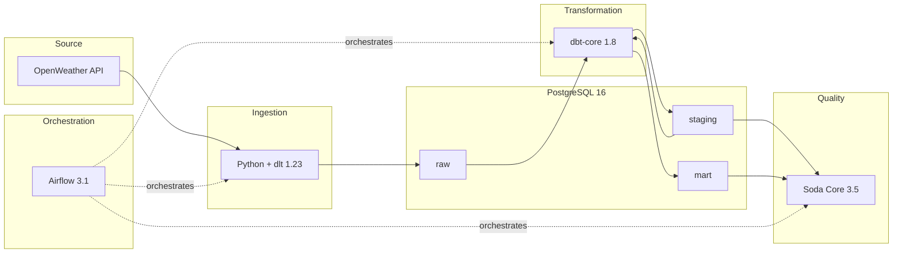
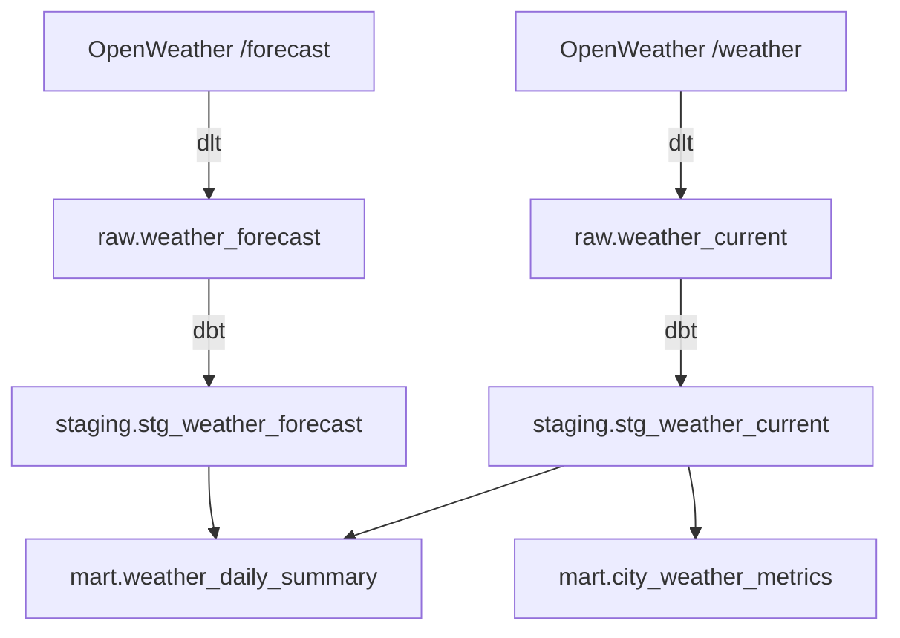

# Weather Data Engineering Pipeline


> A **production-grade data pipeline** that extracts weather data from the OpenWeather API, loads it into PostgreSQL, transforms it with dbt, validates quality with Soda Core, and orchestrates everything with Apache Airflow — fully containerized with Docker.

---

## Architecture



> See [docs/architecture.md](docs/architecture.md) for detailed design decisions.

---

## Tech Stack

| Layer            | Technology         | Version | Purpose                          |
|------------------|--------------------|---------|----------------------------------|
| Orchestration    | Apache Airflow     | 3.1.7   | Workflow scheduling & monitoring |
| Ingestion        | Python + dlt       | 1.23    | API extraction & raw loading     |
| Storage          | PostgreSQL         | 16      | Data warehouse                   |
| Transformation   | dbt-core           | 1.8     | SQL-based data modeling          |
| Data Quality     | Soda Core          | 3.5     | Automated data validation        |
| Infrastructure   | Docker Compose     | v2      | Reproducible environment         |
| Package Manager  | uv                 | latest  | 10-50x faster than pip           |

---

## Quick Start

```bash
# 1. Clone the repository
git clone https://github.com/Adrien-Crapart/data-engineering-pipeline.git
cd data-engineering-pipeline

# 2. Set up environment variables
cp .env.example .env
# Edit .env and add your OpenWeather API key

# 3. Start the pipeline (builds + starts all containers)
make up

# 4. Access Airflow UI
# http://localhost:8080 (user: airflow / password: airflow)

# 5. Verify everything is running
make status
```

### Verify with test data (no API key needed)

```bash
# Seed sample data, run dbt, run Soda checks
make up
make psql < scripts/seed_test_data.sql
make test
```

---

## Project Structure

```
data-engineering-pipeline/
├── airflow/
│   ├── dags/
│   │   └── weather_pipeline_dag.py   # End-to-end DAG (Airflow 3 SDK)
│   └── plugins/
├── ingestion/
│   ├── config.py                     # Typed config from env vars
│   ├── openweather_pipeline.py       # dlt source + pipeline runner
│   └── tests/
│       ├── test_config.py            # 7 config validation tests
│       └── test_pipeline.py          # 6 pipeline tests (mocked API)
├── dbt/
│   ├── models/
│   │   ├── staging/                  # stg_weather_current, stg_weather_forecast
│   │   └── marts/                    # weather_daily_summary, city_weather_metrics
│   ├── tests/singular/               # Custom temperature range test
│   ├── dbt_project.yml
│   └── profiles.yml
├── data_quality/
│   ├── configuration.yml             # Soda Core PostgreSQL connection
│   └── checks/
│       ├── staging_checks.yml        # 10 staging layer checks
│       └── mart_checks.yml           # 9 mart layer checks
├── docker/
│   ├── docker-compose.yml            # Full infrastructure
│   └── airflow.Dockerfile            # Custom image with uv
├── scripts/
│   ├── init_db.sql                   # Schema creation (raw/staging/mart)
│   └── seed_test_data.sql            # Sample data for testing
├── docs/
│   ├── architecture.md               # System design & decisions
│   ├── pipeline.md                   # DAG documentation
│   └── lineage.md                    # Data lineage & column mapping
├── .env.example
├── Makefile
├── requirements.txt
└── README.md
```

---

## Data Layers

| Schema    | Materialization | Description                       | Tables                     |
|-----------|-----------------|-----------------------------------|------------------------------------|
| `raw`     | table (dlt)     | Raw API responses                 | `weather_current`, `weather_forecast` |
| `staging` | view (dbt)      | Cleaned, renamed, typed           | `stg_weather_current`, `stg_weather_forecast` |
| `mart`    | table (dbt)     | Aggregated analytics models       | `weather_daily_summary`, `city_weather_metrics` |

> See [docs/lineage.md](docs/lineage.md) for full column-level data lineage.

---

## Pipeline Details

### Ingestion (dlt)

- **Source:** OpenWeather API (`/weather` + `/forecast`)
- **Destination:** PostgreSQL `raw` schema
- **Features:** Configurable cities, exponential backoff retry (3 attempts), structured logging, automatic schema inference

### Transformation (dbt)

| Model | Type | Description |
|-------|------|-------------|
| `stg_weather_current` | view | Clean + type raw observations |
| `stg_weather_forecast` | view | Unnest + join forecast entries |
| `weather_daily_summary` | table | Daily min/max/avg per city |
| `city_weather_metrics` | table | Overall stats per city |

### Orchestration (Airflow 3.1)

```
extract_weather → dbt_deps → dbt_run → dbt_test → soda_scan → log_metrics
```

- **Schedule:** Every 6 hours (`0 */6 * * *`)
- **Retries:** 2 attempts, 5-minute delay
- **Access:** http://localhost:8080

> See [docs/pipeline.md](docs/pipeline.md) for full DAG documentation.

### Data Quality (Soda Core)

19 automated checks covering:
- **Completeness:** `missing_count = 0` on critical columns
- **Validity:** Temperature range (-90°C to 60°C), humidity (0-100%)
- **Uniqueness:** No duplicate cities in metrics
- **Freshness:** `row_count > 0` on all tables

---

## Testing

**43 total checks** across 4 testing layers:

| Layer | Tool | Checks | Coverage |
|-------|------|--------|----------|
| Unit tests | pytest | 13 | Config validation, retry logic, data extraction |
| Data tests | dbt | 11 | not_null, unique, temperature range |
| Quality checks | Soda Core | 19 | Completeness, validity, uniqueness |
| **Total** | | **43** | |

```bash
# Run unit tests
make test

# Run dbt tests (inside container)
docker compose exec airflow-scheduler bash -c "cd /opt/airflow/dbt && /usr/python/bin/dbt test --profiles-dir ."

# Run Soda checks (inside container)
docker compose exec airflow-scheduler bash -c "POSTGRES_HOST=postgres POSTGRES_PORT=5432 POSTGRES_USER=airflow POSTGRES_PASSWORD=airflow POSTGRES_DB=weather_db /usr/python/bin/soda scan -d weather_db -c /opt/airflow/data_quality/configuration.yml /opt/airflow/data_quality/checks/"
```

---

## Available Commands

| Command        | Description                              |
|----------------|------------------------------------------|
| `make up`      | Build and start all services             |
| `make down`    | Stop and remove all services & volumes   |
| `make build`   | Build images without starting            |
| `make logs`    | Follow service logs                      |
| `make psql`    | Open a PostgreSQL shell                  |
| `make test`    | Run unit tests                           |
| `make status`  | Show service status                      |
| `make restart` | Restart all services                     |
| `make clean`   | Remove containers, volumes, and images   |

---

## Configuration

| Variable                | Description                    | Default                  |
|-------------------------|--------------------------------|--------------------------|
| `OPENWEATHER_API_KEY`   | Your OpenWeather API key       | *(required)*             |
| `WEATHER_CITIES`        | Comma-separated city names     | `Paris,Lyon,Marseille,Toulouse,Nice` |
| `POSTGRES_DB`           | Database name                  | `weather_db`             |
| `POSTGRES_USER`         | Database user                  | `airflow`                |
| `POSTGRES_PASSWORD`     | Database password              | `airflow`                |

Get a free API key at [openweathermap.org/api](https://openweathermap.org/api).

---

## Data Lineage



> See [docs/lineage.md](docs/lineage.md) for column-level lineage.

---

## Documentation

| Document | Description |
|----------|-------------|
| [docs/architecture.md](docs/architecture.md) | System design, Docker services, design decisions |
| [docs/pipeline.md](docs/pipeline.md) | DAG task details, error handling, environment variables |
| [docs/lineage.md](docs/lineage.md) | End-to-end data lineage with column mapping |

---

## Git Workflow

This project follows a **feature branching strategy** with conventional commits:

| Branch | Scope |
|--------|-------|
| `feature/project-setup` | Docker, PostgreSQL, Airflow infrastructure |
| `feature/openweather-ingestion` | dlt pipeline, unit tests |
| `feature/dbt-transformations` | dbt models, data tests |
| `feature/airflow-orchestration` | DAG, scheduling |
| `feature/data-quality` | Soda Core checks |
| `feature/documentation` | README, architecture docs |

---

## Roadmap

- [x] Project setup — Docker, PostgreSQL 16, Airflow 3.1, uv
- [x] Ingestion — OpenWeather API extraction with dlt (13 tests)
- [x] Transformation — dbt staging and mart models (11 dbt tests)
- [x] Orchestration — Airflow DAG with TaskFlow API (validated)
- [x] Data Quality — Soda Core validation checks (19 checks)
- [x] Documentation — Architecture, pipeline, lineage docs

---

## License

This project is licensed under the Apache License 2.0 — see the [LICENSE](LICENSE) file for details.
