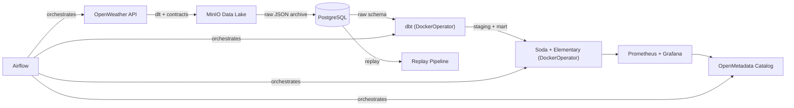

# Weather Data Engineering Pipeline


> Production-grade weather data pipeline demonstrating modern Data Engineering best practices.
> **API → Data Lake → Warehouse → Transformations → Quality → Observability → Catalog**

---

## Architecture



## Technology Stack

| Layer | Technology | Purpose |
|-------|-----------|---------|
| Orchestration | Apache Airflow 3.1 | DAG scheduling and monitoring |
| Ingestion | dlt (Data Load Tool) | API extraction with schema management |
| Data Lake | MinIO (S3-compatible) | Immutable raw data archive |
| Warehouse | PostgreSQL 16 | Layered schemas (raw, staging, mart) |
| Transformation | dbt-core (DockerOperator) | SQL models: staging → mart |
| Data Contracts | YAML + Python validator | Schema governance before storage |
| Data Quality | Soda Core + Great Expectations + Elementary | Automated validation and anomaly detection |
| Monitoring | Prometheus + Grafana | Pipeline metrics, dashboards, alerting |
| Metadata Catalog | OpenMetadata | Data catalog, lineage, profiling |
| Infrastructure | Docker Compose | Reproducible, versioned containers |
| CI/CD | GitHub Actions | Lint, test, build, dbt compile |

## Quick Start

```bash
# 1. Clone the repository
git clone https://github.com/your-username/data-engineering-pipeline.git
cd data-engineering-pipeline

# 2. Set up environment
cp .env.example .env
# Edit .env with your OpenWeather API key (free at openweathermap.org/api)

# 3. Start the core platform
make up

# 4. (Optional) Start with OpenMetadata catalog
make up-full
```

### Service URLs

| Service | URL | Credentials |
|---------|-----|-------------|
| Airflow UI | http://localhost:8080 | airflow / airflow |
| MinIO Console | http://localhost:9001 | minioadmin / minioadmin |
| Grafana | http://localhost:3000 | admin / admin |
| Prometheus | http://localhost:9090 | — |
| OpenMetadata | http://localhost:8585 | — |

## Project Structure

```
data-engineering-pipeline/
├── analytics/           — DuckDB local analytics engine
├── contracts/           — Data contract YAML definitions and validator
├── cursor/              — Cursor AI rules for project conventions
├── data_quality/        — Soda Core checks and Great Expectations suites
├── docs/                — Architecture, pipeline, lineage, ADR documentation
├── infrastructure/      — Docker, Compose, init scripts, processing Dockerfile
├── ingestion/           — dlt pipelines, config, MinIO storage client
├── metadata/            — OpenMetadata ingestion configuration
├── monitoring/          — Prometheus config, Grafana dashboards, metrics exporter
├── orchestration/       — Airflow DAG (single weather_pipeline)
├── replay/              — Historical data replay module (used via Airflow Clear)
├── scripts/             — Utility shell scripts (setup, manual runs)
├── tests/               — Unit and integration tests (86+ tests)
└── transformations/     — dbt models (staging, marts), tests, Elementary
```

Each folder contains a `README.md` with detailed documentation.

## Pipeline Flow

```
extract_weather → dbt_deps → dbt_run → dbt_test → soda_scan → elementary_report → push_metrics
```

- **extract_weather**: `weather-pipeline-dlt:1.0.0` — dlt ingestion + contract validation + MinIO archive
- **dbt_deps/run/test**: `weather-pipeline-dbt:1.0.0` — dbt transformations + Elementary
- **soda_scan**: `weather-pipeline-soda:1.0.0` — Soda Core quality checks
- **elementary_report**: `weather-pipeline-dbt:1.0.0` — Elementary observability report
- **push_metrics**: Airflow TaskFlow — lightweight HTTP push to Prometheus

Re-run from any task via the Airflow UI **Clear** functionality.

## Key Design Decisions

| Decision | Rationale |
|----------|-----------|
| One Dockerfile per tool | Decoupled dependencies and independent resource allocation |
| Slim Airflow image | Providers only — Airflow orchestrates, never processes |
| DockerOperator for all processing | Isolation, reproducibility, resource control |
| Official OpenMetadata ingestion | Separate embedded Airflow, maintained upstream |
| No replay DAG | Airflow Clear = re-run from any task natively |
| Pinned Docker image versions | Reproducible builds, no surprise breakages |
| MinIO as raw data lake | Immutable, replayable, auditable raw data archive |

## Data Layers

| Schema | Layer | Description |
|--------|-------|-------------|
| `raw` | Raw | Unmodified API responses loaded by dlt |
| `staging` | Staging | Cleaned, typed, renamed views |
| `mart` | Mart | Business-ready analytical tables |
| `elementary` | Observability | dbt model monitoring metadata |

## Testing

| Category | Tool | Count | Scope |
|----------|------|-------|-------|
| Unit Tests | pytest | 43+ | Config, pipeline, contracts, MinIO client, metrics, replay, DAGs |
| dbt Tests | dbt test | 11 | Schema tests, data integrity, singular tests |
| Data Quality | Soda Core | 19 | Row counts, nulls, ranges, duplicates |
| Elementary | elementary | 7+ | Volume anomalies, schema changes |
| CI/CD | GitHub Actions | 5 jobs | Lint, test, Docker build, dbt compile, contract validation |

## Available Commands

```bash
make up          # Start core services (Airflow, PostgreSQL, MinIO, Prometheus, Grafana)
make up-full     # Start all services including OpenMetadata
make down        # Stop core services
make down-full   # Stop all services including OpenMetadata
make build       # Build Airflow image
make build-images # Build all processing images (dlt, dbt, soda)
make logs        # Follow service logs
make psql        # Open PostgreSQL shell
make test        # Run unit tests locally via uv
make status      # Show service status
make clean       # Full cleanup (containers + images + volumes)
```

## Documentation

- [Architecture](docs/architecture.md) — System design and service topology
- [Pipeline](docs/pipeline.md) — DAG details, task graph, error handling
- [Data Lineage](docs/lineage.md) — End-to-end and column-level lineage
- [ADR-001](docs/decisions/adr_001_architecture.md) — Architecture decisions

## Git Workflow

Feature branching strategy with conventional commits:

```
master
├── feature/project-setup
├── feature/openweather-ingestion
├── feature/dbt-transformations
├── feature/airflow-orchestration
├── feature/data-quality
├── feature/minio-data-lake
├── feature/data-contracts
├── feature/airflow-remote-logs
├── feature/replay-system
├── feature/monitoring
├── feature/observability
├── feature/openmetadata-catalog
├── feature/ci-cd
├── fix/cursor-rules
├── fix/docker-versioning
├── fix/folder-documentation
├── fix/add-missing-tests
├── fix/airflow-docker-operator
└── fix/update-documentation
```

---

*Built as a technical portfolio project for Data Engineering positions.*
