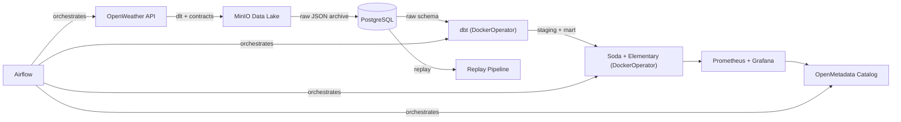

# Weather Data Engineering Pipeline

Python
Airflow
dbt
dlt
PostgreSQL
MinIO
Prometheus
Grafana
Soda
DuckDB
Docker
Tests

> Production-grade weather data pipeline demonstrating modern Data Engineering best practices.
> **API → Data Lake → Warehouse → Transformations → Quality → Observability → Catalog**

---

## Architecture




## Technology Stack


| Layer            | Technology                                  | Purpose                                    |
| ---------------- | ------------------------------------------- | ------------------------------------------ |
| Orchestration    | Apache Airflow 3.1                          | DAG scheduling and monitoring              |
| Ingestion        | dlt (Data Load Tool)                        | API extraction with schema management      |
| Data Lake        | MinIO (S3-compatible)                       | Immutable raw data archive                 |
| Warehouse        | PostgreSQL 16                               | Layered schemas (raw, staging, mart)       |
| Transformation   | dbt-core (DockerOperator)                   | SQL models: staging → mart                 |
| Data Contracts   | YAML + Python validator                     | Schema governance before storage           |
| Data Quality     | Soda Core + Great Expectations + Elementary | Automated validation and anomaly detection |
| Monitoring       | Prometheus + Grafana                        | Pipeline metrics, dashboards, alerting     |
| Metadata Catalog | OpenMetadata                                | Data catalog, lineage, profiling           |
| Infrastructure   | Docker Compose                              | Reproducible, versioned containers         |
| CI/CD            | GitHub Actions                              | Lint, format, unit tests                   |


## Quick Start

### Prerequisites

- [Docker Desktop](https://www.docker.com/products/docker-desktop/)
- [just](https://github.com/casey/just) — `winget install Casey.Just` (Windows) / `brew install just` (macOS) / `cargo install just`
- [uv](https://docs.astral.sh/uv/) — `curl -LsSf https://astral.sh/uv/install.sh | sh`

```bash
# 1. Clone the repository
git clone https://github.com/your-username/data-engineering-pipeline.git
cd data-engineering-pipeline

# 2. Set up environment
cp .env.example .env
# Edit .env with your OpenWeather API key (free at openweathermap.org/api)

# 3. Start the core platform
just start

# 4. (Optional) Start with OpenMetadata catalog
just start-full
```

### Service URLs


| Service       | URL                                            | Credentials             |
| ------------- | ---------------------------------------------- | ----------------------- |
| Airflow UI    | [http://localhost:8080](http://localhost:8080) | airflow / airflow       |
| MinIO Console | [http://localhost:9001](http://localhost:9001) | minioadmin / minioadmin |
| Grafana       | [http://localhost:3000](http://localhost:3000) | admin / admin           |
| Prometheus    | [http://localhost:9090](http://localhost:9090) | —                       |
| OpenMetadata  | [http://localhost:8585](http://localhost:8585) | —                       |


## Project Structure

```
data-engineering-pipeline/
├── analytics/           — DuckDB local analytics engine
├── contracts/           — Data contract YAML definitions and validator
├── cursor/              — Cursor AI rules for project conventions
├── data_quality/        — Soda Core checks and Great Expectations suites
├── docs/                — Architecture, pipeline, lineage, ADR documentation
├── infrastructure/      — Docker, Compose, init scripts, processing Dockerfile
├── ingestion/           — dlt pipelines, config, MinIO storage client
├── metadata/            — OpenMetadata ingestion configuration
├── monitoring/          — Prometheus config, Grafana dashboards, metrics exporter
├── orchestration/       — Airflow DAG (single weather_pipeline)
├── replay/              — Historical data replay module (used via Airflow Clear)
├── scripts/             — Utility shell scripts (setup, manual runs)
├── tests/               — Unit and integration tests (86+ tests)
└── transformations/     — dbt models (staging, marts), tests, Elementary
```

Each folder contains a `README.md` with detailed documentation.

## Pipeline Flow

```
extract_weather → dbt_deps → dbt_run → dbt_test → soda_scan → elementary_report → push_metrics
```

- **extract_weather**: `weather-pipeline-dlt:1.0.0` — dlt ingestion + contract validation + MinIO archive
- **dbt_deps/run/test**: `weather-pipeline-dbt:1.0.0` — dbt transformations + Elementary
- **soda_scan**: `weather-pipeline-soda:1.0.0` — Soda Core quality checks
- **elementary_report**: `weather-pipeline-dbt:1.0.0` — Elementary observability report
- **push_metrics**: Airflow TaskFlow — lightweight HTTP push to Prometheus

Re-run from any task via the Airflow UI **Clear** functionality.

## Key Design Decisions


| Decision                          | Rationale                                                  |
| --------------------------------- | ---------------------------------------------------------- |
| One Dockerfile per tool           | Decoupled dependencies and independent resource allocation |
| Slim Airflow image                | Providers only — Airflow orchestrates, never processes     |
| DockerOperator for all processing | Isolation, reproducibility, resource control               |
| Official OpenMetadata ingestion   | Separate embedded Airflow, maintained upstream             |
| No replay DAG                     | Airflow Clear = re-run from any task natively              |
| Pinned Docker image versions      | Reproducible builds, no surprise breakages                 |
| MinIO as raw data lake            | Immutable, replayable, auditable raw data archive          |


## Data Layers


| Schema       | Layer         | Description                            |
| ------------ | ------------- | -------------------------------------- |
| `raw`        | Raw           | Unmodified API responses loaded by dlt |
| `staging`    | Staging       | Cleaned, typed, renamed views          |
| `mart`       | Mart          | Business-ready analytical tables       |
| `elementary` | Observability | dbt model monitoring metadata          |


## Testing


| Category     | Tool           | Count  | Scope                                                            |
| ------------ | -------------- | ------ | ---------------------------------------------------------------- |
| Unit Tests   | pytest         | 43+    | Config, pipeline, contracts, MinIO client, metrics, replay, DAGs |
| dbt Tests    | dbt test       | 11     | Schema tests, data integrity, singular tests                     |
| Data Quality | Soda Core      | 19     | Row counts, nulls, ranges, duplicates                            |
| Elementary   | elementary     | 7+     | Volume anomalies, schema changes                                 |
| CI/CD        | GitHub Actions | 2 jobs | Lint + format, unit tests                                        |


## Available Commands

> Run `just` with no arguments to see all available recipes.

```bash
# Lifecycle
just start            # Start all core services (ordered)
just start-full       # Start all services including OpenMetadata
just stop             # Stop core services and remove volumes
just restart          # Restart core services
just status           # Show service status
just logs             # Follow service logs

# Build
just build-all        # Build all Docker images
just build-airflow    # Build Airflow image
just build-dlt        # Build DLT runner image
just build-dbt        # Build dbt runner image
just build-soda       # Build Soda runner image
just rebuild          # Force-rebuild all images (no cache)

# Dev Tools
just psql             # Open psql shell on weather_db
just airflow-shell    # Open bash in Airflow worker
just dbt-run          # Run dbt models via Docker
just dbt-test         # Run dbt tests via Docker
just dbt-docs         # Generate dbt docs and upload to S3
just dlt-run          # Run DLT ingestion via Docker
just soda-check       # Run Soda checks via Docker
just gx-check         # Run Great Expectations via Docker

# Quality & Tests
just lint             # Run ruff linter
just format           # Auto-format Python code
just check            # Run all checks (lint + format-check)
just test             # Run unit tests
just test-cov         # Run tests with coverage report

# Ops
just doctor           # Check environment health
just urls             # Show service URLs
just clean            # Remove all containers, volumes, images
just prune            # Docker system prune
```

## Documentation

- [Architecture](docs/architecture.md) — System design and service topology
- [Pipeline](docs/pipeline.md) — DAG details, task graph, error handling
- [Data Lineage](docs/lineage.md) — End-to-end and column-level lineage
- [ADR-001](docs/decisions/adr_001_architecture.md) — Architecture decisions

---

*Built as a technical portfolio project for Data Engineering positions.*