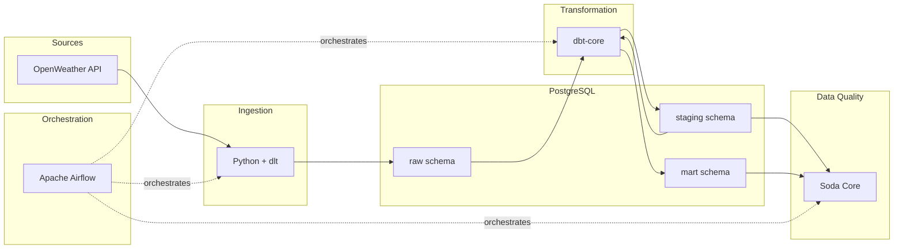

# Weather Data Engineering Pipeline


> A production-grade data pipeline that extracts weather data from the OpenWeather API, loads it into PostgreSQL, transforms it with dbt, validates quality with Soda Core, and orchestrates everything with Apache Airflow — fully containerized with Docker.

---

## Architecture



---

## Tech Stack

| Layer            | Technology         | Version | Purpose                          |
|------------------|--------------------|---------|----------------------------------|
| Orchestration    | Apache Airflow     | 3.1     | Workflow scheduling & monitoring |
| Ingestion        | Python + dlt       | 1.23    | API extraction & raw loading     |
| Storage          | PostgreSQL         | 16      | Data warehouse                   |
| Transformation   | dbt-core           | 1.11    | SQL-based data modeling          |
| Data Quality     | Soda Core          | 3.5     | Automated data validation        |
| Infrastructure   | Docker Compose     | v2      | Reproducible environment         |
| Package Manager  | uv                 | latest  | Fast Python dependency install   |

---

## Quick Start

```bash
# 1. Clone the repository
git clone https://github.com/Adrien-Crapart/data-engineering-pipeline.git
cd data-engineering-pipeline

# 2. Set up environment variables
cp .env.example .env
# Edit .env and add your OpenWeather API key

# 3. Start the pipeline
make up

# 4. Access Airflow UI
# Open http://localhost:8080 (user: airflow / password: airflow)
```

---

## Project Structure

```
data-engineering-pipeline/
├── airflow/
│   ├── dags/                  # Airflow DAG definitions
│   └── plugins/               # Custom Airflow plugins
├── ingestion/                 # dlt extraction pipeline
├── dbt/                       # dbt transformation models
│   └── models/
│       ├── staging/           # Cleaned & typed models
│       └── marts/             # Analytical models
├── data_quality/              # Soda Core checks
├── docker/
│   ├── docker-compose.yml     # Full infrastructure
│   └── airflow.Dockerfile     # Custom Airflow image (uv)
├── scripts/                   # Database init & utilities
├── docs/                      # Architecture documentation
├── .env.example               # Environment template
├── Makefile                   # Developer shortcuts
├── requirements.txt           # Python dependencies
└── README.md
```

---

## Data Layers

| Schema    | Description                       | Example Tables                     |
|-----------|-----------------------------------|------------------------------------|
| `raw`     | Raw API responses loaded by dlt   | `weather_current`, `weather_forecast` |
| `staging` | Cleaned and typed models (views)  | `stg_weather_current`, `stg_weather_forecast` |
| `mart`    | Analytical models (tables)        | `weather_daily_summary`, `city_weather_metrics` |

---

## Available Commands

| Command        | Description                              |
|----------------|------------------------------------------|
| `make up`      | Build and start all services             |
| `make down`    | Stop and remove all services & volumes   |
| `make build`   | Build images without starting            |
| `make logs`    | Follow service logs                      |
| `make psql`    | Open a PostgreSQL shell                  |
| `make test`    | Run unit tests                           |
| `make status`  | Show service status                      |
| `make restart` | Restart all services                     |
| `make clean`   | Remove containers, volumes, and images   |

---

## Configuration

All configuration is managed through environment variables. Copy `.env.example` to `.env` and update the values:

| Variable                | Description                    | Default                  |
|-------------------------|--------------------------------|--------------------------|
| `OPENWEATHER_API_KEY`   | Your OpenWeather API key       | *(required)*             |
| `WEATHER_CITIES`        | Comma-separated city names     | `Paris,Lyon,Marseille,Toulouse,Nice` |
| `POSTGRES_DB`           | Database name                  | `weather_db`             |
| `POSTGRES_USER`         | Database user                  | `airflow`                |
| `POSTGRES_PASSWORD`     | Database password              | `airflow`                |

---

## Roadmap

- [x] Project setup — Docker, PostgreSQL, Airflow infrastructure
- [ ] Ingestion — OpenWeather API extraction with dlt
- [ ] Transformation — dbt staging and mart models
- [ ] Orchestration — Airflow DAG for end-to-end pipeline
- [ ] Data Quality — Soda Core validation checks
- [ ] Documentation — Full architecture docs, lineage, benchmarks

---

## License

This project is licensed under the Apache License 2.0 — see the [LICENSE](LICENSE) file for details.
