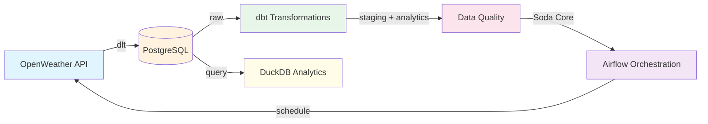

# Weather Data Engineering Pipeline


> Production-grade weather data pipeline demonstrating modern Data Engineering best practices.  
> **API → Ingestion → Storage → Transformation → Quality → Orchestration → Analytics**

---

## Architecture



## Technology Stack

| Layer | Technology | Purpose |
|-------|-----------|---------|
| Orchestration | Apache Airflow 3.1 | DAG scheduling & monitoring |
| Ingestion | dlt (Data Load Tool) | API extraction with schema management |
| Storage | PostgreSQL 16 | Data warehouse with layered schemas |
| Transformation | dbt-core | SQL models: staging → analytics |
| Data Quality | Soda Core + Great Expectations | Automated data validation |
| Analytics | DuckDB | Fast local analytical queries |
| Infrastructure | Docker Compose | Reproducible environment |
| Package Mgmt | uv | Fast Python dependency management |

## Quick Start

```bash
# 1. Clone the repository
git clone https://github.com/your-username/data-engineering-pipeline.git
cd data-engineering-pipeline

# 2. Set up environment
cp .env.example .env
# Edit .env with your OpenWeather API key (free at openweathermap.org/api)

# 3. Start the pipeline
make up

# 4. Open Airflow UI
# http://localhost:8080 (login: airflow / airflow)
```

## Project Structure

```
data-engineering-pipeline/
│
├── README.md                          # Project overview
├── LICENSE
├── .env.example                       # Environment template
├── pyproject.toml                     # Python project config
├── requirements.txt                   # Dependencies
├── Makefile                           # Developer commands
│
├── docs/                              # Documentation
│   ├── architecture.md                # System design
│   ├── pipeline.md                    # DAG documentation
│   ├── lineage.md                     # Data lineage
│   └── decisions/
│       └── adr_001_architecture.md    # Architecture Decision Record
│
├── infrastructure/                    # Infrastructure as Code
│   ├── docker/
│   │   ├── Dockerfile                 # Custom Airflow image
│   │   └── docker-compose.yml         # Service definitions
│   └── scripts/
│       ├── init_db.sql                # Schema initialization
│       └── seed_test_data.sql         # Test data
│
├── ingestion/                         # Data extraction
│   ├── config.py                      # Pipeline configuration
│   ├── pipelines/
│   │   └── openweather_pipeline.py    # dlt pipeline
│   ├── sources/                       # External data sources
│   └── schemas/                       # Data schemas
│
├── orchestration/                     # Workflow management
│   └── airflow/
│       ├── dags/
│       │   └── weather_pipeline_dag.py
│       └── plugins/
│
├── transformations/                   # Data modeling
│   └── dbt/
│       ├── models/
│       │   ├── staging/               # Cleaned views
│       │   └── marts/                 # Analytics tables
│       └── tests/                     # dbt tests
│
├── data_quality/                      # Data validation
│   ├── soda/                          # Soda Core checks
│   │   ├── configuration.yml
│   │   └── checks/
│   └── expectations/                  # Great Expectations
│
├── analytics/                         # Example analytics
│   └── example_queries.sql            # Ready-to-use queries
│
├── monitoring/                        # Observability
│   ├── metrics/
│   └── logging/
│
├── tests/                             # Test suites
│   ├── unit/                          # Unit tests
│   └── integration/                   # Integration tests
│
└── scripts/                           # Utility scripts
    ├── run_pipeline.sh                # Manual pipeline run
    └── setup_env.sh                   # Environment setup
```

## Data Layers

| Schema | Layer | Description | Examples |
|--------|-------|-------------|----------|
| `raw` | Raw | Unmodified API responses | `weather_current`, `weather_forecast` |
| `staging` | Staging | Cleaned, typed, structured | `stg_weather_current`, `stg_weather_forecast` |
| `analytics` | Analytics | Business-ready aggregations | `weather_daily_summary`, `city_weather_metrics` |

## Pipeline Details

### Ingestion (dlt)
- Extracts current weather + 5-day forecast for configurable cities
- Automatic schema inference and evolution
- Built-in retry logic with exponential backoff
- Structured logging with extraction metrics

### Transformation (dbt)
- **Staging models:** clean, cast, and deduplicate raw data
- **Analytics models:** daily summaries, city-level metrics
- Full test coverage with generic and singular tests
- Source freshness monitoring

### Data Quality
- **Soda Core:** row counts, null checks, valid ranges, duplicate detection
- **Great Expectations:** comprehensive expectation suites
- Integrated into the Airflow DAG as validation gates

### Orchestration (Airflow 3)
```
extract_weather → dbt_deps → dbt_run → dbt_test → soda_scan → log_metrics
```
- TaskFlow API for Python tasks
- BashOperator for dbt and Soda commands
- 6-hour schedule with retry logic
- FAB authentication (username/password login)

## Testing

| Category | Tool | Count | Scope |
|----------|------|-------|-------|
| Unit Tests | pytest | 13 | Config validation, API mocks, pipeline logic |
| dbt Tests | dbt test | 11 | Schema tests, data integrity, singular tests |
| Data Quality | Soda Core | 19 | Row counts, nulls, ranges, duplicates |
| **Total** | | **43** | |

## Available Commands

```bash
make up        # Start all services (build + detach)
make down      # Stop and remove all services + volumes
make build     # Build Docker images
make logs      # Follow service logs
make psql      # Open PostgreSQL shell
make test      # Run unit tests
make status    # Show service status
make restart   # Restart all services
make clean     # Full cleanup (containers + images + volumes)
```

## Configuration

Copy `.env.example` to `.env` and configure:

| Variable | Description | Required |
|----------|-------------|----------|
| `OPENWEATHER_API_KEY` | API key from openweathermap.org | Yes |
| `WEATHER_CITIES` | Comma-separated city list | Yes |
| `POSTGRES_*` | Database credentials | No (defaults provided) |
| `AIRFLOW__CORE__FERNET_KEY` | Encryption key | No (default provided) |

## Documentation

- [Architecture](docs/architecture.md) — System design and Docker services
- [Pipeline](docs/pipeline.md) — DAG details, task graph, error handling
- [Data Lineage](docs/lineage.md) — End-to-end and column-level lineage
- [ADR-001](docs/decisions/adr_001_architecture.md) — Architecture decisions

## Git Workflow

Feature branching strategy with conventional commits:

```
main
├── feature/project-setup
├── feature/openweather-ingestion
├── feature/dbt-transformations
├── feature/airflow-orchestration
├── feature/data-quality
├── feature/documentation
├── feature/fix-airflow-auth
├── feature/restructure-project
├── feature/add-duckdb
└── feature/add-great-expectations
```

## What This Demonstrates

| Skill | Implementation |
|-------|---------------|
| Data Ingestion | dlt pipeline with retry, logging, metrics |
| Data Modeling | dbt staging → analytics with tests |
| Orchestration | Airflow 3 DAG with TaskFlow API |
| Data Quality | Soda Core + Great Expectations |
| Analytics | DuckDB queries on pipeline output |
| Infrastructure | Docker Compose, custom images, uv |
| Documentation | README, ADRs, architecture diagrams |
| Testing | pytest, dbt tests, Soda checks |
| Version Control | Feature branches, conventional commits |

---

*Built as a technical portfolio project for Data Engineering positions.*
