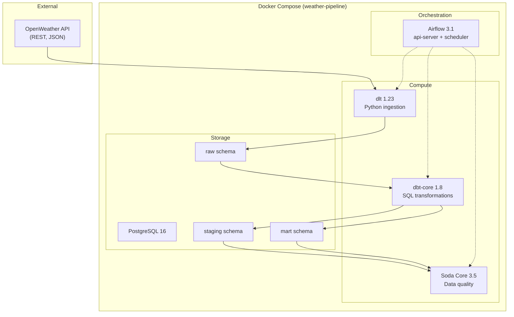

# Architecture

## System Overview

The Weather Data Engineering Pipeline follows a **layered data architecture** pattern commonly used in modern data platforms. Each layer has a clear responsibility, enabling separation of concerns and independent testing.

## Data Flow

| Step | Component | Input | Output | Frequency |
|------|-----------|-------|--------|-----------|
| 1 | dlt | OpenWeather API | `raw.weather_current`, `raw.weather_forecast` | Every 6h |
| 2 | dbt staging | Raw tables | `staging.stg_weather_current`, `staging.stg_weather_forecast` | After ingestion |
| 3 | dbt mart | Staging views | `mart.weather_daily_summary`, `mart.city_weather_metrics` | After staging |
| 4 | Soda Core | Staging + mart | Quality report (pass/fail) | After transformation |

## Docker Services

| Service | Image | Port | Purpose |
|---------|-------|------|---------|
| `postgres` | postgres:16-alpine | 5432 | Data warehouse |
| `airflow-api-server` | Custom (Airflow 3.1.7) | 8080 | Airflow UI and REST API |
| `airflow-scheduler` | Custom (Airflow 3.1.7) | — | DAG scheduling and execution |
| `airflow-init` | Custom (Airflow 3.1.7) | — | One-shot DB migration and user creation |

## Design Decisions

| Decision | Choice | Rationale |
|----------|--------|-----------|
| Orchestrator | Airflow 3.1 | Industry standard, latest version with TaskFlow API and SDK |
| Ingestion | dlt | Declarative, schema inference, built-in PostgreSQL destination |
| Transformation | dbt-core | SQL-first, testable, generates lineage documentation |
| Data quality | Soda Core | SodaCL YAML checks, integrates with Airflow via CLI |
| Package manager | uv | 10-50x faster than pip, drop-in replacement |
| Executor | LocalExecutor | Sufficient for single-node; avoids Redis/Celery overhead |
| Python | 3.12 | Default for Airflow 3.1, best performance |
