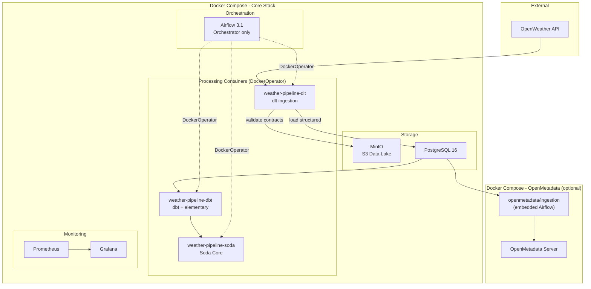

# Architecture

## System Overview

The Weather Data Engineering Pipeline follows a **layered data architecture** pattern.
Each processing tool runs in its own isolated Docker container. Airflow only orchestrates.

## Data Flow

| Step | Container | Input | Output | Frequency |
|------|-----------|-------|--------|-----------|
| 1 | `weather-pipeline-dlt` | OpenWeather API | MinIO raw JSON + `raw.weather_*` | Every 6h |
| 2 | `weather-pipeline-dbt` | Raw tables | `staging.stg_*` views | After ingestion |
| 3 | `weather-pipeline-dbt` | Staging views | `mart.*` tables | After staging |
| 4 | `weather-pipeline-soda` | Staging + mart | Quality report (pass/fail) | After transformation |
| 5 | `weather-pipeline-dbt` | All models | Elementary anomaly detection | After quality |
| 6 | Airflow TaskFlow | Metrics | Prometheus Pushgateway | After all tasks |

## Docker Images

### Processing Images (one per tool)

| Image | Dockerfile | Dependencies | Purpose |
|-------|------------|-------------|---------|
| `weather-pipeline-dlt:1.0.0` | `Dockerfile.dlt` | dlt, minio, pyyaml, requests | API ingestion + data lake archive |
| `weather-pipeline-dbt:1.0.0` | `Dockerfile.dbt` | dbt-postgres, edr, elementary | Transformations + observability |
| `weather-pipeline-soda:1.0.0` | `Dockerfile.soda` | soda-core-postgres | Data quality checks |

### Infrastructure Images

| Service | Image | Purpose |
|---------|-------|---------|
| Airflow | apache/airflow:3.1.7-python3.12 | Orchestration only (slim: providers + prometheus_client) |
| PostgreSQL | postgres:16-alpine | Data warehouse |
| MinIO | minio:RELEASE.2025-09-07 | S3-compatible data lake |
| Prometheus | prometheus:v3.10.0 | Metrics collection |
| Grafana | grafana:12.4.0 | Dashboards and alerting |

### OpenMetadata Stack (optional)

| Service | Image | Purpose |
|---------|-------|---------|
| openmetadata-server | openmetadata/server:1.12.1 | Catalog UI and API |
| openmetadata-ingestion | openmetadata/ingestion:1.12.1 | Embedded Airflow for metadata collection |
| openmetadata-mysql | mysql:8.4 | Backend |
| openmetadata-elasticsearch | elasticsearch:8.15.0 | Search |

## Design Decisions

| Decision | Choice | Rationale |
|----------|--------|-----------|
| One Dockerfile per tool | dlt, dbt, soda | Decoupled dependencies and resource allocation |
| Slim Airflow image | Providers only | Airflow orchestrates, never processes |
| DockerOperator for all | Mount host dirs | Isolation, reproducibility, resource control |
| Official OM ingestion | `openmetadata/ingestion` | Independent from project Airflow, maintained upstream |
| No replay DAG | Airflow Clear | Native Airflow feature to re-run from any task |
| Pinned Docker versions | Specific tags | Reproducible builds |
| MinIO data lake | S3-compatible | Immutable, replayable raw data archive |
| PROJECT_ROOT env var | Host path for mounts | DockerOperator needs absolute host paths |
