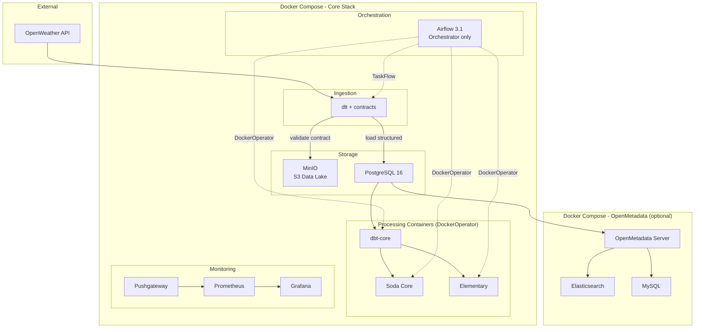

# Architecture

## System Overview

The Weather Data Engineering Pipeline follows a **layered data architecture** pattern commonly used in modern data platforms. Each layer has a clear responsibility, enabling separation of concerns and independent testing.

## Data Flow

| Step | Component | Input | Output | Frequency |
|------|-----------|-------|--------|-----------|
| 1 | Contract validation | API response | Validated JSON | Every 6h |
| 2 | MinIO archive | Validated JSON | `s3://weather-data-lake/raw/openweather/year=.../` | Every 6h |
| 3 | dlt load | Validated JSON | `raw.weather_current`, `raw.weather_forecast` | Every 6h |
| 4 | dbt staging | Raw tables | `staging.stg_weather_current`, `staging.stg_weather_forecast` | After ingestion |
| 5 | dbt mart | Staging views | `mart.weather_daily_summary`, `mart.city_weather_metrics` | After staging |
| 6 | Soda Core | Staging + mart | Quality report (pass/fail) | After transformation |
| 7 | Elementary | All models | Anomaly detection, schema change monitoring | After quality |
| 8 | Prometheus | Pipeline metrics | Time-series metrics | Continuous |

## Docker Services

### Core Stack (`docker-compose.yml`)

| Service | Image | Port | Purpose |
|---------|-------|------|---------|
| `postgres` | postgres:16-alpine | 5432 | Data warehouse |
| `airflow-api-server` | Custom (Airflow 3.1.7) | 8080 | Airflow UI and REST API |
| `airflow-scheduler` | Custom (Airflow 3.1.7) | — | DAG scheduling (+ Docker socket mount) |
| `airflow-dag-processor` | Custom (Airflow 3.1.7) | — | DAG parsing |
| `airflow-init` | Custom (Airflow 3.1.7) | — | DB migration, user creation, connection setup |
| `minio` | minio:RELEASE.2025-09-07 | 9000/9001 | S3-compatible data lake |
| `minio-init` | mc:RELEASE.2025-08-13 | — | Bucket creation |
| `prometheus` | prometheus:v3.10.0 | 9090 | Metrics collection |
| `prometheus-pushgateway` | pushgateway:v1.11.2 | 9091 | Ephemeral metrics push |
| `grafana` | grafana:12.4.0 | 3000 | Dashboards and alerting |
| `processing` | Custom (Python 3.12) | — | dbt/Soda/Elementary processing image |

### OpenMetadata Stack (`docker-compose.openmetadata.yml`)

| Service | Image | Port | Purpose |
|---------|-------|------|---------|
| `openmetadata-server` | openmetadata/server:1.12.1 | 8585 | Metadata catalog UI and API |
| `openmetadata-mysql` | mysql:8.4 | 3306 | OpenMetadata backend |
| `openmetadata-elasticsearch` | elasticsearch:8.15.0 | 9200 | Search engine |

## Design Decisions

| Decision | Choice | Rationale |
|----------|--------|-----------|
| DockerOperator for processing | Isolated containers | Airflow orchestrates only; processing runs in dedicated images |
| Pinned Docker versions | Specific tags | Reproducible builds, no surprise breakages |
| MinIO data lake | S3-compatible | Immutable, replayable raw data; enables replay/backfill |
| Data contracts | YAML + validator | Schema governance before storage; catch issues at ingestion |
| Separate OM compose | Optional stack | Keep core stack lightweight; catalog only when needed |
| Remote Airflow logs | MinIO S3 | Avoid disk saturation on Airflow workers |
| Elementary | dbt package | Volume anomalies, schema changes, freshness monitoring |
| Prometheus + Grafana | Push model | Pipeline metrics, dashboards, SLA-based alerting |
| GitHub Actions CI | 5 parallel jobs | Lint, test, build, compile, contract validation |
| Python 3.12 | Airflow 3.1 default | Best performance, required by Airflow base image |
