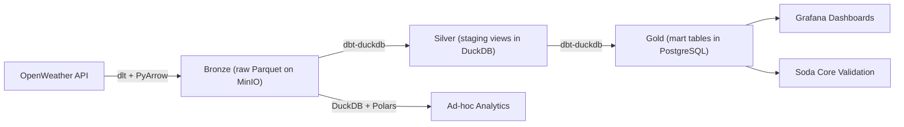

# Lakehouse Architecture

This project implements a **medallion lakehouse architecture** with MinIO as the S3-compatible
object store and DuckDB as the analytical query engine.

## Medallion Layers



| Layer | Storage | Format | Engine | Purpose |
|-------|---------|--------|--------|---------|
| Bronze (raw) | MinIO S3 | Parquet (ZSTD) | dlt + PyArrow | Immutable raw API responses |
| Silver (staging) | DuckDB in-memory | Views | dbt-duckdb | Cleaned, typed, renamed fields |
| Gold (mart) | PostgreSQL | Tables | dbt-duckdb -> postgres | Business-ready analytical tables |

## Why Parquet on S3?

- **Columnar format**: 5-10x compression vs JSON, fast analytical reads
- **Schema evolution**: Parquet supports schema merging across files
- **Decoupled storage/compute**: data persists independently from query engines
- **Multi-engine access**: DuckDB, Polars, Spark, Athena can all read the same files
- **Versioning**: each dlt load creates timestamped Parquet files

## Partition Strategy

dlt writes Parquet files to MinIO S3 using this layout:

```
s3://data-lake/
└── raw/
    ├── weather_current/
    │   ├── <load_id_1>.<file_id>.parquet
    │   └── <load_id_2>.<file_id>.parquet
    ├── weather_forecast/
    │   └── ...
    └── weather_forecast__list/
        └── ...
```

Each load creates new Parquet files with unique load IDs, ensuring immutability
and full auditability of the raw layer.

## DuckDB as the Transformation Engine

dbt-duckdb reads Parquet directly from S3 via the `httpfs` extension:

```sql
SELECT * FROM read_parquet('s3://data-lake/raw/weather_current/**/*.parquet')
```

Staging models are DuckDB views (zero storage cost). Mart models are materialized
to PostgreSQL via the `postgres` extension attachment:

```yaml
# dbt profile attaches PostgreSQL
attach:
  - path: "dbname=weather_db user=airflow ..."
    alias: pg
    type: postgres
```

```sql
-- Mart models target the attached PostgreSQL database
{{ config(materialized='table', database='pg', schema='mart') }}
```

## Schema Evolution

dlt handles schema evolution automatically:

1. New columns are added to the Parquet files without breaking existing reads
2. DuckDB's `read_parquet` with `union_by_name=true` merges schemas across files
3. dbt models reference only the columns they need, tolerating new additions

## Comparison with Previous Architecture

| Aspect | Before (PostgreSQL raw) | After (Parquet Lakehouse) |
|--------|------------------------|--------------------------|
| Raw storage | PostgreSQL tables | Parquet on MinIO S3 |
| Raw format | Flattened JSON rows | Columnar Parquet (ZSTD) |
| Storage cost | Higher (row-oriented) | Lower (5-10x compression) |
| Query engine | PostgreSQL only | DuckDB + PostgreSQL |
| Schema evolution | dlt manages PG schema | Parquet schema merging |
| Multi-engine | No | DuckDB, Polars, PyArrow |
| Immutability | Append-only tables | Immutable Parquet files |
| Replayability | Re-run from Clear | Re-read any historical file |

## Analytics Access Patterns

### DuckDB SQL (ad-hoc queries)

```python
from analytics.duckdb_analytics import WeatherAnalytics
analytics = WeatherAnalytics.from_env()
analytics.top_hottest_cities(limit=5)
```

### Polars DataFrame (high-performance processing)

```python
df = analytics.raw_to_polars("weather_current")
result = df.lazy().filter(pl.col("main__temp") > 25).collect()
```

### PyArrow Table (interop)

```python
arrow_table = analytics.raw_to_arrow("weather_current")
```
