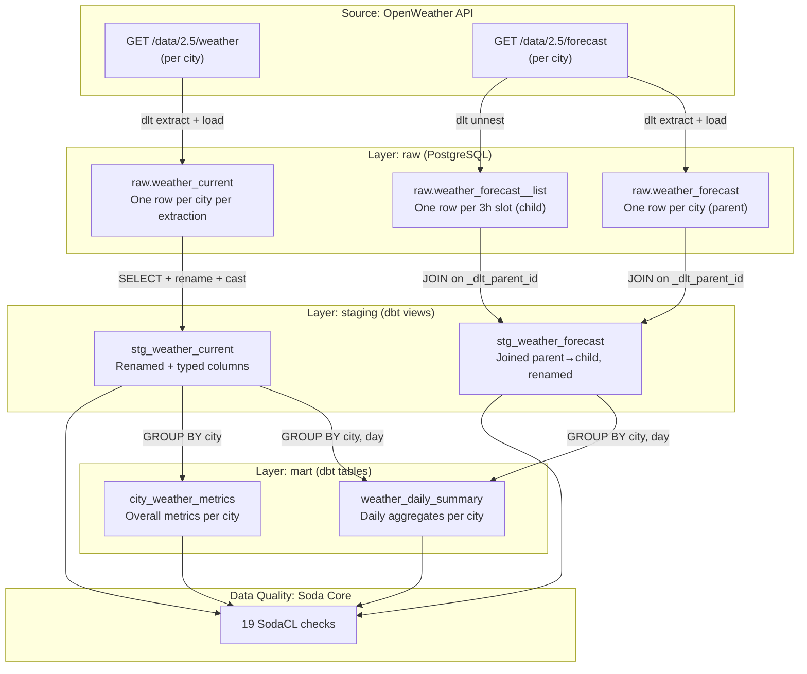

# Data Lineage

## End-to-End Lineage

## Column Lineage

### `stg_weather_current`

| Target Column | Source | Transformation |
|--------------|--------|----------------|
| `city_name` | `raw.weather_current.name` | Direct mapping |
| `country_code` | `raw.weather_current.sys__country` | Direct mapping |
| `temperature_celsius` | `raw.weather_current.main__temp` | Direct mapping (metric units) |
| `humidity_percent` | `raw.weather_current.main__humidity` | Direct mapping |
| `measured_at` | `raw.weather_current.dt` | `to_timestamp(dt)` |

### `stg_weather_forecast`

| Target Column | Source | Transformation |
|--------------|--------|----------------|
| `city_name` | `raw.weather_forecast.city__name` | JOIN parent table |
| `temperature_celsius` | `raw.weather_forecast__list.main__temp` | Direct mapping |
| `forecast_at` | `raw.weather_forecast__list.dt` | `to_timestamp(dt)` |

### `weather_daily_summary`

| Target Column | Source | Transformation |
|--------------|--------|----------------|
| `date_day` | `stg_*.measured_at / forecast_at` | `date_trunc('day', ...)` |
| `avg_temperature_celsius` | `stg_*.temperature_celsius` | `avg()` grouped by city + day |
| `dominant_weather_condition` | `stg_*.weather_condition` | `mode()` grouped by city + day |

### `city_weather_metrics`

| Target Column | Source | Transformation |
|--------------|--------|----------------|
| `total_observations` | `stg_weather_current.*` | `count(*)` grouped by city |
| `avg_temperature_celsius` | `stg_weather_current.temperature_celsius` | `avg()` grouped by city |
| `first_observation` | `stg_weather_current.measured_at` | `min()` grouped by city |
